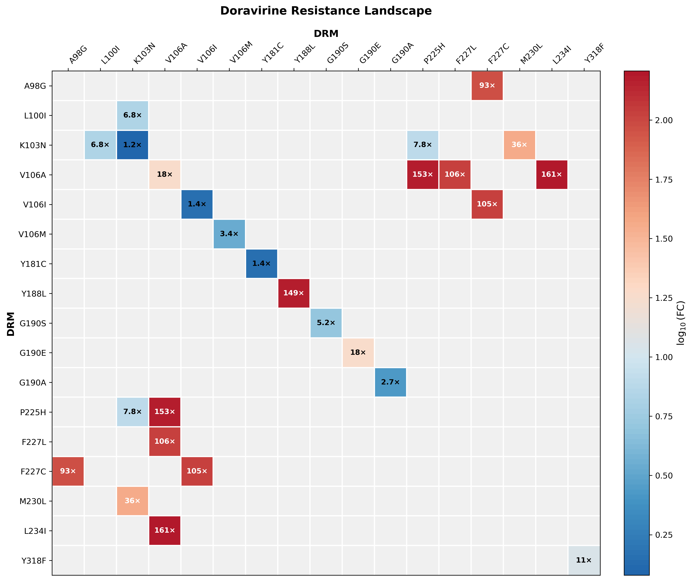
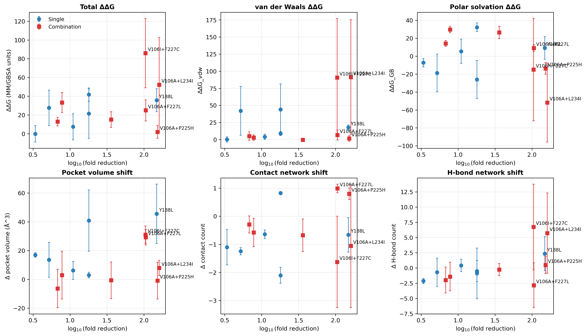
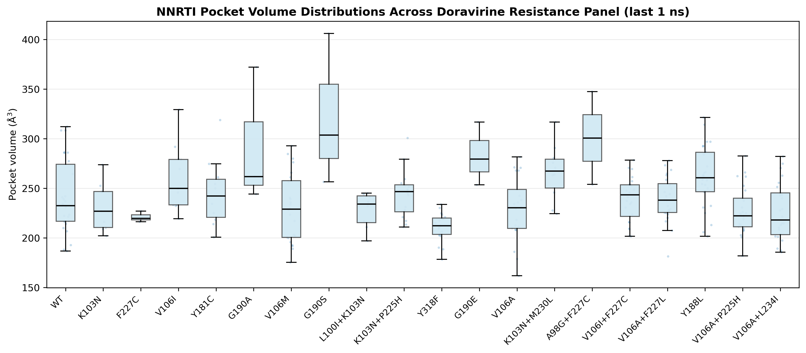
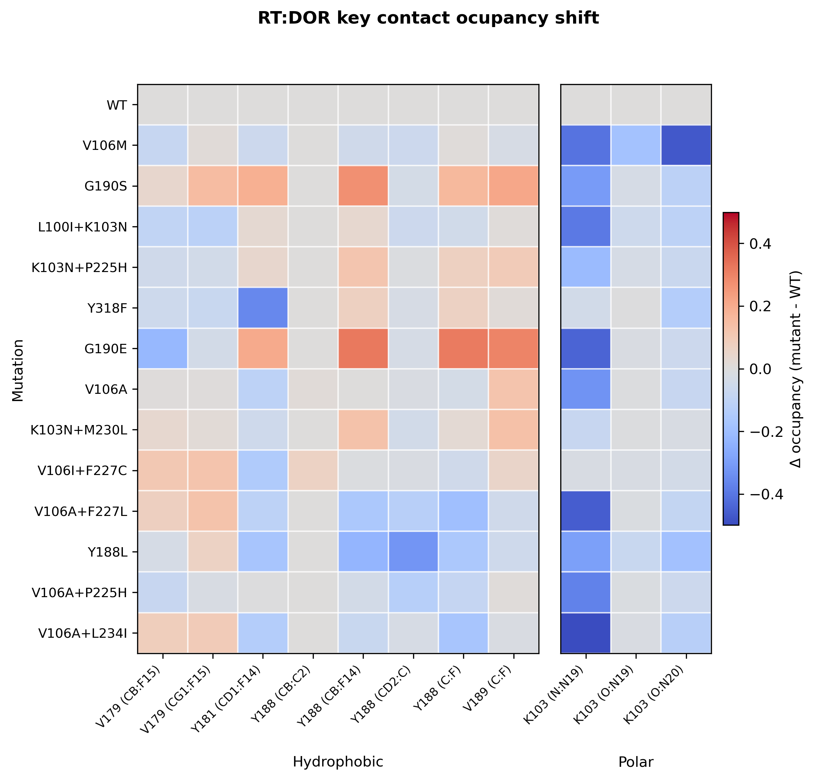
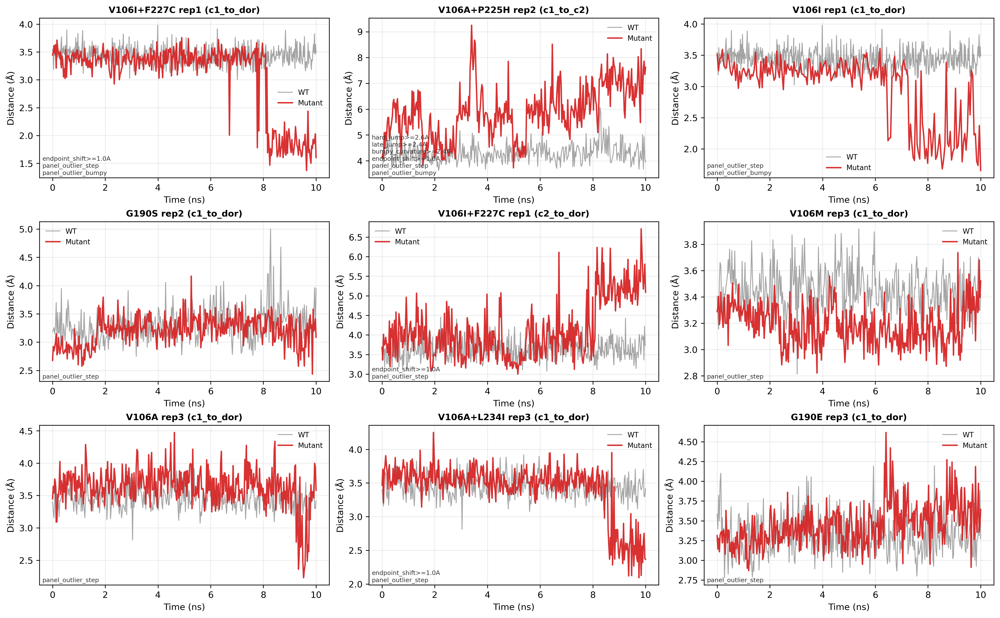

# Doravirine Resistance Mechanisms in HIV-1 Reverse Transcriptase: A Mechanism-Forward Synthesis of Established NNRTI Literature and a 14-Genotype Explicit-Solvent MD Panel

## Abstract
Doravirine (DOR; MK-1439) is a next-generation non-nucleoside reverse transcriptase inhibitor (NNRTI) with favorable activity against several historically common NNRTI resistance-associated mutations (RAMs), but specific substitutions (e.g., Y188L, V106A/M) and multi-mutation pathways (e.g., V106* with secondary pocket mutations) can produce large reductions in phenotypic susceptibility [1-8]. To interpret doravirine genotypes mechanistically, we first review established NNRTI inhibition principles (RT architecture and catalytic cycle; induced-fit NNRTI pocket formation; allosteric coupling from the pocket to the polymerase active site; and resistance modes including pocket reshaping, aromatic clamp disruption, polar/solvation rewiring, and epistatic coupling) with an investigator-forward emphasis on foundational work by Eddy Arnold, Steve H. Hughes, and David K. Stammers [9-60]. We then analyze a completed explicit-solvent MD panel of 14 genotypes (WT plus 13 mutants/combos) with 3 replicates each (42 total trajectories, 10 ns production each), starting from a doravirine-bound RT complex derived from PDB 4NCG and using solute-only analysis trajectories (`*_analysis.dcd`) [1,9,61-66]. Across the panel, high-resistance genotypes show a coherent ensemble signature anchored to specific 4NCG contacts and quantitative shifts: (i) strong pocket expansion in Y188L (dPocket +45.6 A^3), (ii) depletion of the Lys103 backbone-to-doravirine anchor `polar_LYS103_N_N19` (e.g., -0.499 in V106A+L234I), and (iii) extreme van der Waals MM/GBSA penalties (kJ/mol) in pocket-wall double mutants (e.g., V106I+F227C ddG_vdw +90.6; V106A+L234I ddG_vdw +91.4). Distance-trace event analysis highlights abrupt rearrangements in specific replicates (e.g., V106A+P225H rep2 `c1_to_c2` max step 2.86 A at 9.83 ns), consistent with genotype-dependent ensemble gating for partial disengagement or pose destabilization. We summarize mutation-by-mutation hypotheses that can be directly tested with the existing trajectories and motivate follow-up biochemical/structural experiments (binding kinetics, resistance selections, and structure determination in resistant backgrounds).

## Introduction
HIV-1 reverse transcriptase (RT) remains a central target for antiretroviral therapy, and the NNRTI class has historically been defined by high potency coupled to low genetic barriers to resistance for first-generation compounds. Doravirine (DOR; MK-1439) was developed to retain activity across many common NNRTI RAMs while maintaining favorable dosing and tolerability [1-3]. In vitro selection and clinical/sequence-database studies nonetheless show clear doravirine-associated pathways, including single substitutions (V106A/M, Y188L, G190S/E, Y318F) and combinations involving residues in or coupled to the NNRTI pocket (e.g., K103N+P225H, V106A+F227L, V106A+L234I) that can drive high-level phenotypic resistance [4-8].

Mechanistically, NNRTIs (e.g., nevirapine, efavirenz, etravirine, rilpivirine, doravirine) bind a shared induced-fit pocket adjacent to the polymerase active site. In crystal structures, this pocket is bounded by an entrance polar region near K101/K103, an aromatic wall in the 180-190 loop (Y181/Y188/G190), and a primer-grip wall in the beta12-beta13-beta14 sheet (P225/F227/W229/M230/L234) [11-15,19,75,76]. The pocket is not preformed; it is created/enlarged by induced fit, and pocket occupancy is allosterically coupled to the polymerase machinery [9-20]. Resistance therefore has multiple concrete routes beyond a single "steric clash": recontouring of pocket volume (V106*, G190*), removal of aromatic clamp packing (Y181C, Y188L, F227*), disruption of entrance polar/hydration patterns (K103N, K101E), and epistatic coupling between these changes in multi-mutation genotypes [14-20,21-30].

This manuscript is a literature-forward, mechanism-forward study/review hybrid. We first summarize key established mechanisms in NNRTI inhibition and resistance with emphasis on foundational structural and mechanistic work pioneered by Arnold, Hughes, and Stammers [9-60]. We then interpret a completed, phenotype-anchored explicit-solvent MD panel (14 genotypes x 3 replicates) using ensemble structural metrics, key-contact fingerprints, and MM/GBSA-style decompositions to propose testable hypotheses of doravirine resistance mechanisms.

## Background: Established NNRTI Mechanisms and Resistance Principles

### RT architecture, catalytic cycle, and the role of conformational ensembles
HIV-1 RT is a heterodimeric enzyme (p66/p51) that combines polymerase and RNase H activities. Structural work established the overall "right-hand" architecture (fingers/palm/thumb) and the spatial separation between the polymerase active site and the RNase H domain [9,10]. The polymerase active site resides in the p66 palm and uses conserved catalytic aspartates (Asp110 and the YMDD-motif Asp185/Asp186) to catalyze phosphodiester bond formation, while the nucleic-acid binding cleft and primer-template trajectory are shaped by the fingers and thumb subdomains [11,75-77].

For NNRTIs, two concrete points from this literature matter for resistance mechanisms:
1. **Polymerase catalysis is gated by specific structural transitions that are allosterically coupled to the NNRTI pocket.** In the canonical cycle, RT must (i) bind primer-template, (ii) bind an incoming dNTP and sample a catalytically competent closed state, and (iii) reopen and translocate by one base pair after chemistry and pyrophosphate release. Structural snapshots of RT in distinct functional states (unliganded RT, RT/DNA, and inhibitor-trapped incorporation vs pyrophosphorolysis/translocation states) show that these steps involve coordinated rearrangements of the fingers/thumb and the beta12-beta13-beta14 sheet that contains the "primer grip" (residues ~225-235) [11,67,76,77]. NNRTI-bound structures (including nevirapine-bound RT and RT/DNA complexes) show that occupying the pocket displaces this primer-grip region and biases RT away from catalytically optimal geometries, providing a structural basis for noncompetitive inhibition kinetics [14,19,93].
2. **Resistance can arise from mutations that never touch the ligand because the pocket is built from coupled structural elements.** Pocket-wall residues span the p66 palm (K101/K103 region), the 180-190 loop (Y181/Y188/G190), and the beta12-beta13-beta14/primer-grip sheet (P225/F227/W229/M230/L234) [11-15,19,75,76]. Mutations in any of these elements can remove direct packing interactions (e.g., Y181C or Y188L), recontour the pocket (e.g., V106A/M/I, G190S/E), or rewire polar "entrance" contacts (e.g., K103N) in ways that propagate into altered pocket shape and inhibitor pose ensembles [14-20,73,74].

### The NNRTI pocket: induced fit and allosteric coupling
Early RT-NNRTI complex structures demonstrated that chemically diverse NNRTIs bind to a shared allosteric site adjacent to the polymerase active site and that binding involves induced-fit remodeling of local secondary structure and sidechain packing [12-18]. The Stammers and Arnold groups were central in establishing the "common pocket" concept for diverse NNRTIs and in demonstrating how induced fit creates a binding-competent cavity rather than simply occupying a pre-existing site [12-15,79-82]. These structural foundations also established a practical resistance logic: mutations can act by preventing pocket formation, altering pocket shape, or degrading the energetic payoff of the induced-fit state [12-20,73,74].

At a residue-level, the NNRTI pocket is bounded by hydrophobic and aromatic residues (classically including Y181, Y188, F227, W229, and M230) and by polar residues near the pocket entrance (notably K101/K103 region) that can participate in direct or water-mediated interactions depending on inhibitor chemistry [12-20,73,74]. This arrangement naturally supports multiple mechanistic failure modes:
- **Clamp disruption:** substitutions at Y181/Y188/F227/W229 can remove aromatic/hydrophobic packing elements.
- **Shape/void creation:** substitutions at V106, G190, M230, and L234 can change local pocket geometry, opening voids or causing steric crowding.
- **Entrance-network rewiring:** substitutions at K103 (or coupled residues) can rewire polar interactions and hydration near the pocket entrance.

### Mechanistic models of NNRTI inhibition (structural and ensemble views)
Mechanistic proposals for NNRTI inhibition have been grounded in a series of increasingly information-rich structure/function comparisons, evolving from early "static distortion" language to an ensemble-centric view that integrates induced fit, conformational gating, and coupling to catalytic sub-steps [11,14,18,19,31-36,73]. Several models are compatible and can coexist:
1. **Primer-grip displacement / active-site misalignment ("molecular wedge") model.** In classic RT-NNRTI structures from the Stammers group and in later Arnold RT/DNA/NNRTI structures, pocket occupancy displaces the beta12-beta13-beta14/primer-grip sheet relative to DNA-bound states and perturbs the vicinity of the YMDD catalytic loop, providing a direct structural route to reduced nucleotide incorporation even though the inhibitor does not occlude the active site [14,19,11].
2. **Conformational selection and dynamic exchange.** Experiments that directly probe RT conformational equilibria capture exchange between NNRTI-bound and NNRTI-free conformations and show that the NNRTI pocket is conformationally plastic on experimentally relevant timescales; in this view, NNRTIs inhibit by biasing the population away from an incorporation-competent state and resistance mutations weaken that bias [18,54,73].
3. **Pose-ensemble/hydration model for flexible NNRTIs.** High-resolution structures of etravirine and rilpivirine (DAPY inhibitors) formalized the "wiggling/jiggling" adaptability principle and implicated pocket water networks in stabilizing alternative poses; resistance can therefore emerge by mutations that increase the probability of hydrated, weakly packed poses without a single obvious steric clash [16,17,27-30].

### Flexible NNRTIs and resistance: "wiggling/jiggling" as a design principle
Second-generation diarylpyrimidine (DAPY) NNRTIs (etravirine, rilpivirine) were designed to retain potency against common pocket mutations by exploiting conformational adaptability: modest torsional adjustments ("wiggling") and positional shifts ("jiggling") allow the ligand to maintain favorable interactions across mutated pocket landscapes [21-26]. High-resolution structures and mechanistic analyses from Arnold, Hughes, and collaborators formalized this paradigm and provided a structural basis for why some inhibitors exhibit higher genetic barriers than others [21-27]. Later work further emphasized the role of water networks and conformational equilibria in enabling or limiting such adaptability [27-30].

For doravirine specifically, the key conceptual import of this literature is not that doravirine is a DAPY, but that **the bound state depends on a small set of anchoring contacts whose occupancy can be redistributed across an ensemble**. In the doravirine-bound crystal structure used here (PDB 4NCG), doravirine (2KW) makes two backbone polar contacts to Lys103 (LYS103:O - 2KW:N20 and LYS103:N - 2KW:N19 in our contact-definition set) and packs against the aromatic wall formed by Tyr181 and Tyr188 (e.g., TYR181:CD1 - 2KW:F14 and multiple TYR188 - 2KW hydrophobic contacts) [1,61-66]. Resistance mutations can therefore act by removing an aromatic wall residue (e.g., Y188L), reshaping local volume around V106/G190 to force an alternative pose, or disrupting the Lys103-proximal polar anchor and allowing more hydrated orientations, even if the ligand remains "bound" by a coarse distance metric [4-8,18,21-30,73,74].

### Resistance mechanism taxonomy for NNRTIs (and why epistasis is expected)
Resistance to NNRTIs can arise through multiple physical routes, often simultaneously:

1. **Direct pocket reshaping and packing failure.** Mutations can expand, contract, or re-contour the pocket to reduce shape complementarity and van der Waals packing (e.g., V106A/M/I as a pocket-shape determinant; G190S/E in the 180-190 loop; L234I in the primer-grip sheet), increasing the energetic cost of maintaining the bound pose [14-20,21-30].
2. **Aromatic clamp disruption.** Substitutions at key aromatic residues (e.g., Y181C, Y188L, F227C/L, W229) can eliminate pi-stacking or hydrophobic clamp interactions critical for binding; these mutations are often high-impact for early NNRTIs and can remain important even for flexible inhibitors [14-20,21-30].
3. **Polar/solvation rewiring.** Mutations at the pocket entrance (e.g., K103N, K101E) and nearby polar residues can change hydrogen-bonding patterns and hydration, altering the balance between protein-ligand electrostatics and solvent competition [14-20,27-30,42-46,70].
4. **Long-range coupling and connection-domain effects.** Mutations outside the immediate pocket (e.g., connection-domain substitutions such as Y318F, and other "connection" mutations studied in nevirapine complexes) can affect NNRTI susceptibility by altering subdomain coupling and polymerase kinetics that are coupled back into pocket geometry and access [18-20,31-36].
5. **Epistasis (non-additivity).** Because the pocket is conformationally plastic and coupled to distal networks, one mutation can change the structural/energetic context in which a second mutation acts. Combination genotypes can therefore produce larger-than-additive resistance, especially when a primary mutation perturbs pocket plasticity (e.g., V106A) and a secondary mutation destabilizes key pocket-wall/primer-grip packing (e.g., F227* or L234I) [18,21-30,47-52].

### Doravirine-specific structural and resistance context
Doravirine was discovered as an NNRTI with activity across a wide range of resistant mutants [1]. Doravirine selection experiments and database analyses converge on a set of doravirine-associated RAMs including V106A/M/I, V108I, Y188L, G190S/E, F227C/L/V, M230I/L, L234I, Y318F, and specific combinations such as K103N+P225H and L100I+K103N [4-8]. Recent cryo-EM structures of RT/DNA complexes with doravirine and rilpivirine (including resistant backgrounds) provide a direct structural foundation for interpreting doravirine-specific pathways and for comparing doravirine to DAPY-class inhibitors in the context of conformational adaptability and pocket water networks [2,27-30].

For the specific doravirine-bound reference state used throughout this manuscript (4NCG), two interaction clusters are useful to keep explicit: (i) the **Lys103 backbone polar anchor** (LYS103:O - 2KW:N20 and LYS103:N - 2KW:N19) and (ii) the **aromatic wall/clamp contacts** formed by Tyr181 and Tyr188 (e.g., TYR181:CD1 - 2KW:F14; TYR188:CD2 - 2KW:C; TYR188:CB - 2KW:F14) [1,61-66]. Many doravirine-associated pathways (V106A/M/I, G190S/E, Y188L, F227C/L, L234I, P225H) can be interpreted as ways to weaken one or both clusters either directly (Y188L) or indirectly by reshaping the pocket volume and allowing alternative poses/hydration states that de-occupy these contacts [4-8,12-20,21-30].

From a mechanism standpoint, doravirine-associated pathways often combine (i) primary pocket-shape mutations (V106A/M/I; G190S/E) with (ii) secondary pocket-wall or clamp mutations (F227C/L; M230*; L234I; P225H). This architecture is consistent with an epistasis-prone landscape: a primary mutation can alter pocket plasticity or entrance solvation, while a secondary mutation disrupts a stabilizing packing element, jointly producing a large shift in the bound ensemble and (potentially) faster escape kinetics [4-8,12-20,18,21-30,73,74].

## Results: Mechanistic Hypotheses Tested in Explicit-Solvent MD Ensembles

### Study panel and MD overview
We analyzed an explicit-solvent MD panel comprising WT plus 13 doravirine-relevant genotypes (14 total), with 3 independent replicates per genotype (42 simulations total). Each simulation used a doravirine-bound RT complex prepared from PDB 4NCG (doravirine; ligand resname `2KW`) and run for 10 ns NPT production with solute-only analysis trajectories saved as `*_analysis.dcd` [1,61-66]. All 42 trajectories passed a distance-based "boundness" QC gate, supporting the interpretation of ensemble metrics as within-pocket binding ensembles rather than fully unbound states (QC summary in `results/boundness_qc.csv`) [61-66].

Panel genotypes and median doravirine fold-reduction values used for phenotype anchoring (from `results/md_manifest.csv`) are:
WT; V106M (3.4); G190S (5.2); L100I+K103N (6.8); K103N+P225H (7.8); Y318F (11); G190E (18); V106A (18); K103N+M230L (36); V106I+F227C (105); V106A+F227L (106); Y188L (149); V106A+P225H (153); V106A+L234I (161) [4-8,61-66].

**Figure 1. Phenotype landscape (MD panel).** Doravirine median fold-reduction values for the 14-genotype panel.

### Global mechanistic signatures align with phenotype more strongly for structural deltas than for total MM/GBSA ddG
We computed replicate-level MM/GBSA-style binding energy components from solute-only trajectory snapshots and ensemble structural metrics (contact count, H-bond count, pocket volume). We then aggregated to mutation-level means and computed WT-referenced deltas for the structural metrics (matched by replicate id). Figure 2 summarizes these global signatures as a function of `log10(fold reduction)` (singles vs combinations).

Two high-level patterns stand out:
1. **Pocket volume shifts and contact-network shifts tend to increase with resistance.** For example, Y188L shows the largest mean pocket-volume expansion (+45.6 A^3 vs WT), while highly resistant double mutants also show substantial expansion (e.g., V106I+F227C +31.1 A^3; V106A+F227L +29.3 A^3) [61-66].
2. **Energetic components indicate mutation-class-dependent failure modes (MM/GBSA ddG components are in kJ/mol, mutant minus WT).** Some high-resistance double mutants show extreme van der Waals penalties (e.g., V106I+F227C ddG_vdw +90.6 kJ/mol; V106A+L234I ddG_vdw +91.4 kJ/mol), consistent with packing/shape complementarity failure. In contrast, V106A+P225H shows a near-zero mean total ddG (+1.9 kJ/mol) despite a large electrostatic destabilization (ddG_elec +13.9 kJ/mol) that is canceled by a favorable GB term (ddG_GB -13.7 kJ/mol), consistent with a polar/solvation-driven and/or ensemble/kinetic mechanism not well captured by endpoint-style MM/GBSA averages [61-66].

**Figure 2. Global mechanistic signatures vs phenotype.** Mutation-level means (3 replicates) for MM/GBSA ddG (kJ/mol) and structural deltas vs WT (pocket volume, contact count, H-bond count).

### Pocket-volume distributions reveal genotype-dependent pocket expansion and heterogeneity
Because pocket reshaping is inherently an ensemble property, we examined frame-level pocket volume distributions across the panel, focusing on the last 1 ns of each replicate. Several of the most resistant genotypes show upward-shifted distributions and/or increased dispersion, consistent with a "plastic pocket" model in which doravirine samples more weakly packed poses and/or the pocket opens sufficiently to admit alternative hydration/solvation states that compete with ligand packing.

Notably, Y188L (149-fold) shows a pronounced shift to larger pocket volume values relative to WT, consistent with removal of an aromatic clamp residue and the creation of additional void volume near the ligand (mean dPocket +45.6 A^3). Several high-resistance double mutants also show clear upward shifts (V106I+F227C, 105-fold, mean dPocket +31.1 A^3; V106A+F227L, 106-fold, +29.3 A^3; V106A+L234I, 161-fold, +8.0 A^3), supporting a coupled mechanism in which primary V106 substitutions increase pocket plasticity while secondary pocket mutations (F227*, L234*, P225H) reshape stabilizing packing elements [61-66].

**Figure 3. Pocket volume distributions by genotype.** Boxplot with downsampled scatter overlay of frame-level pocket volume values (last 1 ns per replicate).

### Key-contact occupancy fingerprints implicate aromatic-clamp and Lys103-proximal polar contacts
To connect global trends to specific structural interactions, we computed key-contact occupancies for a curated set of crystal-derived protein-ligand contacts from the 4NCG doravirine complex. Occupancy was defined as the fraction of frames with `distance <= (distance_ref + 1.0 A)` and averaged across replicates. Figure 4 shows occupancy shifts vs WT, ordered by phenotype.

Across multiple genotypes, two contact clusters dominate the high-resistance signatures:
1. **Aromatic wall/clamp hydrophobics from Tyr181/Tyr188.** For example, Y188L shows a large loss of `hydrophobic_TYR188_CD2_C` (-0.321) and `hydrophobic_TYR181_CD1_F14` (-0.171), while V106A+F227L loses `hydrophobic_TYR188_C_F` (-0.191) and `hydrophobic_TYR188_CB_F14` (-0.156) [61-66].
2. **The Lys103 backbone polar anchor to doravirine ring nitrogens.** The contact `polar_LYS103_N_N19` (LYS103 backbone N to 2KW N19) drops by -0.499 in V106A+L234I and -0.457 in V106A+F227L; the companion `polar_LYS103_O_N20` also decreases (e.g., -0.124 in V106A+L234I and -0.087 in V106A+F227L) [61-66].

**Figure 4. Key-contact occupancy fingerprint.** Heatmap of occupancy shifts (mutant - WT) for crystal-derived contact IDs.

### Distance-trace "events" suggest genotype-dependent gating/rearrangement modes
We also analyzed sidechain-to-doravirine (and, for double mutants, sidechain-to-sidechain) minimum heavy-atom distances over time for mutation-site residues. A simple outlier/event scoring highlights replicates showing abrupt distance jumps, high curvature ("bumpy" traces), or endpoint shifts relative to baseline behavior. These events do not imply full unbinding (boundness QC remains OK) but provide mechanistic clues about mutation-specific rearrangements that can underlie resistance via ensemble destabilization (increased population of weakly bound poses, transient partial disengagement, or altered clamp geometry).

For example, the top-scoring event in the entire panel is V106I+F227C replicate 1 (`c1_to_dor`): a max step of 1.88 A at 7.77 ns and an endpoint shift of 1.60 A in the V106 sidechain-to-dor distance. V106A+P225H replicate 2 shows a large late `c1_to_c2` jump (max step 2.86 A at 9.83 ns; endpoint shift 1.56 A), consistent with a late rearrangement of the two mutation-site sidechains relative to one another. V106A+L234I replicate 3 shows a substantial `c1_to_dor` endpoint shift (max step 1.67 A at 8.75 ns; endpoint shift 1.09 A). A moderate-resistance example is G190S replicate 2 (`c1_to_dor` max step 1.15 A at 9.89 ns) [61-66]. Here, `c1` and `c2` denote the first and second mutation component in the genotype label.

**Figure 5. Interesting distance traces (top events).** Multi-panel traces for the top-scoring mutation-site distance events.

### Mutation-by-mutation synthesis (mechanistic hypotheses)
Below we summarize concise, testable hypotheses that connect phenotype to structural/energetic signatures in our ensembles, framed by established NNRTI mechanisms [14-30,47-52].

**Low to moderate resistance**
- **V106M (3.4-fold):** dPocket +17.0 A^3 with near-zero mean ddG (-0.1 kJ/mol) due to offsetting components (ddG_elec +7.0 kJ/mol; ddG_GB -7.2 kJ/mol), despite net losses in contacts/H-bonds (dContacts -1.10; dHbonds -2.13). Mechanistically, V106M appears to loosen pocket packing while maintaining binding free energy through electrostatic/solvation compensation [61-66].
- **G190S (5.2-fold):** ddG +27.6 kJ/mol is dominated by a large van der Waals penalty (ddG_vdw +42.0 kJ/mol) with a moderate pocket expansion (dPocket +13.6 A^3), consistent with local packing frustration in the 180-190 loop. Replicate 2 shows a late sidechain-to-dor step (`c1_to_dor` max step 1.15 A at 9.89 ns), consistent with an abrupt local rearrangement rather than smooth relaxation [61-66].
- **L100I+K103N (6.8-fold):** modest pocket contraction (dPocket -6.3 A^3) with decreased H-bonding (dHbonds -1.99) and moderate ddG (+12.9 kJ/mol) suggests weakened entrance anchoring and local repacking rather than gross pocket opening [61-66].
- **K103N+P225H (7.8-fold):** modest pocket expansion (dPocket +3.0 A^3) with ddG +33.3 kJ/mol (largely ddG_GB +29.7 kJ/mol) is consistent with an "entrance/polar network" mechanism in which altered local hydration and primer-grip geometry weakens doravirine stabilization [14-20,61-66].
- **Y318F (11-fold):** moderate mean pocket expansion (dPocket +6.2 A^3) and modest ddG (+7.4 kJ/mol) are consistent with a distal coupling mutation that perturbs the pocket contact network without gross reshaping [31-36,61-66].

**Intermediate to high resistance**
- **V106A (18-fold):** V106A has ddG +21.4 kJ/mol driven by ddG_vdw +44.1 kJ/mol with compensating ddG_GB -26.0 kJ/mol. The pocket modestly expands (dPocket +3.0 A^3) while contacts increase (dContacts +0.82), supporting a "mis-packed contacts" model: more contact surface area but worse packing [61-66].
- **G190E (18-fold):** very large pocket expansion (dPocket +40.9 A^3) with ddG +41.8 kJ/mol dominated by solvation terms (ddG_GB +32.1 kJ/mol) is consistent with strong polar/solvation repatterning in the 180-190 loop region [14-20,42-46,61-66].
- **K103N+M230L (36-fold):** near-neutral mean pocket shift (dPocket -0.6 A^3) with ddG +15.2 kJ/mol and a large GB penalty (ddG_GB +26.4 kJ/mol) but favorable electrostatics (ddG_elec -10.7 kJ/mol) is consistent with altered solvation/packing balance near the distal primer-grip wall (M230) combined with entrance perturbation [14-20,61-66].

**Very high resistance (combinations)**
- **V106I+F227C (105-fold):** strong pocket expansion (dPocket +31.1 A^3) with extreme packing penalty (ddG +85.9 kJ/mol; ddG_vdw +90.6 kJ/mol) supports a "packing catastrophe" model. Even modest losses in aromatic-wall contacts (e.g., `hydrophobic_TYR181_CD1_F14` -0.146) accompany large distance-trace events (`c1_to_dor` max step 1.88 A at 7.77 ns; endpoint shift 1.60 A), consistent with ensemble destabilization [14-20,61-66].
- **V106A+F227L (106-fold):** strong pocket expansion (dPocket +29.3 A^3) with the largest H-bond depletion in the panel (dHbonds -2.84) and strong loss of the Lys103 backbone anchor (`polar_LYS103_N_N19` -0.457) suggests a combined hydrophobic-clamp + polar-anchor failure mode [14-20,61-66].
- **Y188L (149-fold):** the largest mean pocket expansion (dPocket +45.6 A^3) and direct loss of Tyr188-derived contacts (`hydrophobic_TYR188_CD2_C` -0.321) strongly support aromatic-clamp removal as a primary driver; the Lys103 anchor is also weakened (`polar_LYS103_N_N19` -0.294), consistent with increased pose/hydration heterogeneity [4-8,14-20,61-66].
- **V106A+P225H (153-fold):** extremely high phenotype with near-zero mean ddG (+1.9 kJ/mol) but strong electrostatic destabilization (ddG_elec +13.9 kJ/mol, canceled by ddG_GB -13.7 kJ/mol) plus a large late `c1_to_c2` jump (2.86 A at 9.83 ns; endpoint shift 1.56 A) suggests a mechanism dominated by ensemble gating/pose rearrangements rather than a single static packing penalty [31-36,61-66].
- **V106A+L234I (161-fold):** modest pocket expansion (dPocket +8.0 A^3) with the largest van der Waals penalty (ddG_vdw +91.4 kJ/mol) and strong loss of the Lys103 anchor (`polar_LYS103_N_N19` -0.499) supports a coupled reshaping model: primer-grip repacking (L234I) plus a V106A-primed pocket forces doravirine into systematically suboptimal packing across the ensemble [14-20,61-66].

## Discussion: Toward a Unified Model of Doravirine Resistance
Taken together, the literature and our ensemble signatures support a unifying mechanistic model in which doravirine resistance can be decomposed into a small number of mutation-class axes that combine nonlinearly:

1. **Aromatic-clamp loss and pocket void creation.** Y188L (149-fold) shows the largest mean pocket expansion (dPocket +45.6 A^3) and direct loss of Tyr188 clamp contacts (e.g., `hydrophobic_TYR188_CD2_C` -0.321), consistent with an aromatic-wall removal mechanism. Secondary clamp-wall changes at F227 (e.g., V106I+F227C, 105-fold) couple this void creation to large packing penalties (ddG_vdw +90.6 kJ/mol) [61-66].
2. **V106-driven pocket-shape priming.** V106A (18-fold) shows ddG_vdw +44.1 kJ/mol with a small pocket expansion (dPocket +3.0 A^3), consistent with a pose/packing retuning rather than a simple steric block. When combined with a second pocket-wall/primer-grip mutation, the signature can become catastrophic (V106I+F227C ddG_vdw +90.6 kJ/mol; V106A+L234I ddG_vdw +91.4 kJ/mol) [61-66].
3. **Entrance polar-anchor erosion at Lys103.** Multiple high-resistance genotypes de-occupy the Lys103 backbone-to-doravirine contacts defined in 4NCG, especially `polar_LYS103_N_N19` (e.g., -0.499 in V106A+L234I; -0.457 in V106A+F227L), providing a concrete polar/solvation axis that can operate even when global pocket-volume changes are modest [61-66].
4. **Epistatic ensemble gating.** Some genotypes show phenotype far larger than their mean MM/GBSA ddG, pointing to kinetics/ensemble effects. V106A+P225H (153-fold) has ddG +1.9 kJ/mol on average but shows a large late mutation-site rearrangement (`c1_to_c2` max step 2.86 A at 9.83 ns; endpoint shift 1.56 A) and substantial loss of the Lys103 anchor (`polar_LYS103_N_N19` -0.374), consistent with metastable binding ensembles and intermittent partial disengagement [61-66].

Across the panel, the most resistant combinations (V106I+F227C, V106A+L234I) pair pocket expansion (dPocket +31.1 and +8.0 A^3) with very large van der Waals penalties (ddG_vdw +90.6 and +91.4 kJ/mol) and depletion of specific 4NCG contact clusters. Y188L uniquely maximizes both pocket expansion and aromatic-clamp contact loss. These quantitative, mutation-resolved signatures translate directly into testable hypotheses for follow-up experiments (e.g., measure doravirine residence time/kon/koff for V106A+P225H vs V106A+L234I; solve resistant structures to test predicted loss of the Lys103 backbone anchor and Tyr181/Tyr188 clamp contacts).

## Methods

### System definition and mutation panel
All simulations used a doravirine-bound HIV-1 RT complex derived from PDB 4NCG (doravirine; ligand resname `2KW`, chain C; protein chains A/B) [1]. The 4NCG structure contains RT and doravirine only (no DNA/RNA), so the MD panel targets doravirine pocket binding ensembles rather than specific catalytic-cycle states. Mutant structures were generated by applying the requested amino-acid substitutions (single or double) to the template structure, producing one prepared complex per (genotype, replicate) with a small deterministic coordinate jitter for replicate diversity [61-66].

### Force field and explicit-solvent system preparation
Protein parameters used AMBER14 ff14SB; solvent was explicit TIP3P; and the ligand was parameterized via an OpenFF SMIRNOFF template generator with Gasteiger partial charges [63-66]. Systems were solvated with 1.0 nm padding and 0.15 M ionic strength, then exported as OpenMM-ready assets (topology PDB and system XML) [63-66].

### MD protocol (OpenMM)
Prepared systems were simulated with OpenMM using:
- Constraints on bonds to hydrogen and a 2 fs timestep.
- Particle mesh Ewald electrostatics with a 1.0 nm real-space cutoff.
- Three-stage minimization (with C-alpha restraints reduced then released), then NVT heating from 10 K to 300 K over 25 ps.
- NPT production at 300 K and 1 bar (Langevin middle integrator; Monte Carlo barostat) for 10 ns per replicate [63-66].

To support robust post hoc analysis, a stripped solute-only trajectory (`*_analysis.dcd`) and matching solute-only topology (`*_analysis_topology.pdb`) were saved at an interval set to yield ~200 frames per 10 ns run [63-66].

### Boundness QC
We computed a conservative minimum heavy-atom distance between doravirine and the protein at the start structure and across a subsampled trajectory. A replicate was flagged OK if the minimum distance stayed below a permissive bound threshold; all 42 runs were OK (`results/boundness_qc.csv`) [61-66].

### Ensemble structural metrics
Using MDAnalysis, we computed ensemble metrics on the solute-only analysis trajectories:
- Contact count: number of protein residues within 4.0 A of any ligand heavy atom.
- H-bond count: number of unique protein-ligand hydrogen-bond pairs per frame (DA cutoff 3.5 A; angle cutoff 135 deg).
- Pocket volume: grid-based count of solvent-accessible voxels within an 8.0 A sphere centered on the ligand, excluding voxels within approximate receptor vdW radii; reported in A^3 [61-66].

Metrics were computed on a strided subset of frames (default stride 5, max 200 sampled frames) taken from the last 1 ns of each production trajectory. The last-1-ns window was defined by mapping trajectory frame indices to the total production length inferred from the per-replicate `*_md_state.csv` reporter output (with a dt-based fallback if needed) [61-66].

### Key-contact occupancy
We defined a set of crystal-derived doravirine pocket contacts from 4NCG (`results/dor_key_contact_definitions_4ncg.csv`). For each contact and frame we computed the specified inter-atomic distance and defined occupancy using the threshold `distance <= distance_ref + 1.0 A`. Occupancies were averaged over frames and replicates, and WT-referenced deltas were visualized as a heatmap [61-66].

### Sidechain distance traces and "interesting event" scoring
For each mutation component (and for double mutants, both components), we computed minimum heavy-atom distances between mutation-site sidechains and doravirine (and between the two sidechains). We scored traces for abrupt steps, late jumps, high curvature, and endpoint shifts relative to panel baselines to prioritize mechanistically informative events [61-66].

### MM/GBSA-style decomposition
MM/GBSA-style components were computed from solute-only trajectory snapshots by evaluating nonbonded energies in OpenMM, decomposed into van der Waals and electrostatic contributions (NoCutoff), and implicit-solvent terms using a GBSA-OBC model with a surface-area term. All energy components are reported in kJ/mol. Per-replicate ddG values used in Results are computed as (mutant - WT) using the matched WT replicate id, then summarized as mutation-level means over the three replicates [61-66].

### Reproducible analysis commands
All analysis and plotting in this repository should be run in the `nnrti-prep` conda environment. When generating plots, set `MPLCONFIGDIR` to a writable path.

## Data and Code Availability
- Manuscript figures are stored in `results/plots/` and are referenced from this file by relative path.
- Canonical result tables are `results/structural_metrics.csv`, `results/mmgbsa_replicate_metrics.csv`, and the merged `results/ddg_full.csv` (42 rows = 14 genotypes x 3 replicates).
- Recompute merged results (uses caching unless `NNRTI_FORCE_RECOMPUTE=1`):
  - `MPLCONFIGDIR=/tmp/mplconfig PYTHONPATH=. conda run -n nnrti-prep python -m src.main --collect-results`
- Regenerate manuscript figures:
  - `MPLCONFIGDIR=/tmp/mplconfig PYTHONPATH=. conda run -n nnrti-prep python -m src.analysis.cli.plot_resistance_heatmap --output results/plots/resistance_heatmap.png`
  - `MPLCONFIGDIR=/tmp/mplconfig PYTHONPATH=. conda run -n nnrti-prep python -m src.analysis.cli.plot_mmgbsa_component_signatures --ddg-full results/ddg_full.csv --output results/plots/manuscript_global_signatures.png`
  - `MPLCONFIGDIR=/tmp/mplconfig PYTHONPATH=. conda run -n nnrti-prep python -m src.analysis.cli.plot_pocket_volume_distributions --profiles results/pocket_volume_profiles.csv --manifest results/md_manifest.csv --md-runs-dir results/md_runs --last-window-ns 1.0 --output results/plots/pocket_volume_distribution_by_mutation.png`
  - `MPLCONFIGDIR=/tmp/mplconfig PYTHONPATH=. conda run -n nnrti-prep python -m src.analysis.cli.plot_key_contact_occupancy_heatmap --timeseries-dir results/dor_key_contacts_timeseries_by_mutation --contact-defs results/dor_key_contact_definitions_4ncg.csv --manifest results/md_manifest.csv --output results/plots/dor_key_contact_occupancy_heatmap.png`
  - `MPLCONFIGDIR=/tmp/mplconfig PYTHONPATH=. conda run -n nnrti-prep python -m src.analysis.cli.plot_interesting_drm_distance_traces --interesting results/drm_sidechain_distance_interesting_traces.csv --timeseries results/drm_sidechain_distance_timeseries_all_mutations.csv --output results/plots/interesting_drm_distance_traces.png`

## References
1. Cote B, Burch JD, Asante-Appiah E, et al. Discovery of MK-1439, an orally bioavailable non-nucleoside reverse transcriptase inhibitor potent against a wide range of resistant mutant HIV viruses. Bioorg Med Chem Lett. 2014;24:917-922. doi:10.1016/j.bmcl.2013.12.070. PMID:24412110.
2. Singh AK, De Wijngaert B, Bijnens M, et al. Cryo-EM structures of wild-type and E138K/M184I mutant HIV-1 RT/DNA complexed with inhibitors doravirine and rilpivirine. Proc Natl Acad Sci U S A. 2022;119:e2203660119. doi:10.1073/pnas.2203660119. PMID:35858448.
3. Feng M, Wang D, Grobler JA, et al. In vitro resistance selection with doravirine (MK-1439), a novel nonnucleoside reverse transcriptase inhibitor. Antimicrob Agents Chemother. 2015;59(1):590-598. doi:10.1128/AAC.04201-14. PMID:25385110.
4. Brenner BG, Oliveira M, Ibanescu RI, Routy JP, Thomas R. Cell culture selections reveal favourable drug resistance profiles for doravirine and islatravir. J Antimicrob Chemother. 2021;76(8):2137-2142. doi:10.1093/jac/dkab126. PMID:33855437.
5. Brenner BG, Oliveira M, Ibanescu RI, Routy JP, Thomas R. Doravirine responses to HIV-1 viruses bearing mutations to NRTIs and NNRTIs under in vitro selective drug pressure. J Antimicrob Chemother. 2023;78(8):1921-1928. doi:10.1093/jac/dkad184. PMID:37303226.
6. Soulie C, Santoro MM, Charpentier C, et al. Rare occurrence of doravirine resistance-associated mutations in HIV-1-infected treatment-naive patients. J Antimicrob Chemother. 2019;74(3):614-617. doi:10.1093/jac/dky464. PMID:30476106.
7. Soulie C, et al. Prevalence of doravirine-associated resistance mutations in HIV-1-infected antiretroviral-experienced patients from two large databases in France and Italy. J Antimicrob Chemother. 2020. doi:10.1093/jac/dkz553. PMID:31976534.
8. Reddy N, Papathanasopoulos M, Steegen K, Basson AE. K103N, V106M and Y188L significantly reduce HIV-1 subtype C phenotypic susceptibility to doravirine. Viruses. 2024;16(9):1493. doi:10.3390/v16091493. PMID:39339969.
9. Kohlstaedt LA, Wang J, Friedman JM, Rice PA, Steitz TA. Crystal structure at 3.5 A resolution of HIV-1 reverse transcriptase complexed with an inhibitor. Science. 1992;256(5065):1783-1790. doi:10.1126/science.1377403. PMID:1377403.
10. Davies JF 2nd, Hostomska Z, Hostomsky Z, Jordan SR, Matthews DA. Crystal structure of the ribonuclease H domain of HIV-1 reverse transcriptase. Science. 1991;252(5002):88-95. doi:10.1126/science.1707186. PMID:1707186.
11. Sarafianos SG, Marchand B, Das K, Himmel DM, Parniak MA, Hughes SH, Arnold E. Structure and function of HIV-1 reverse transcriptase: molecular mechanisms of polymerization and inhibition. J Mol Biol. 2009;385(3):693-713. doi:10.1016/j.jmb.2008.10.071. PMID:19022262.
12. Das K, Ding J, Hsiou Y, et al.; Hughes SH; Arnold E. Structure of HIV-1 RT/TIBO R 86183 complex reveals similarity in the binding of diverse nonnucleoside inhibitors. Structure. 1995;3(4):365-379. PMID:7613864.
13. Ren J, Esnouf R, Garman E, et al.; Stammers DK. High resolution structures of HIV-1 RT from four RT-inhibitor complexes. Nat Struct Biol. 1995;2(4):293-302. doi:10.1038/nsb0495-293. PMID:7540934.
14. Esnouf RM, Ren J, Ross C, et al.; Stammers DK. Mechanism of inhibition of HIV-1 reverse transcriptase by non-nucleoside inhibitors. Nat Struct Biol. 1995;2(4):303-308. doi:10.1038/nsb0495-303. PMID:7540935.
15. Das K, Ding J, Hsiou Y, Clark AD Jr, Moereels H, Koymans L, Andries K, Pauwels R, Janssen PAJ, Boyer PL, Clark P, Hughes SH, Arnold E. Crystal structures of 8-Cl and 9-Cl TIBO complexed with wild-type HIV-1 reverse transcriptase and 8-Cl TIBO complexed with the Tyr181Cys mutant. J Mol Biol. 1996;264(5):1085-1100. PMID:9000632.
16. Das K, Clark AD Jr, Lewi PJ, et al.; Hughes SH; Arnold E. Roles of conformational and positional adaptability in structure-based design of TMC125-R165335 (etravirine) and TMC278 (rilpivirine). J Med Chem. 2004;47(10):2550-2560. doi:10.1021/jm030533y. PMID:15115400.
17. Das K, Bauman JD, Clark AD Jr, et al.; Hughes SH; Arnold E. High-resolution structures of HIV-1 reverse transcriptase/TMC278 complexes: strategic flexibility explains potency against resistance mutations. Proc Natl Acad Sci U S A. 2008;105(5):1466-1471. doi:10.1073/pnas.0711209105. PMID:18230722.
18. Kuroda DG, Bauman JD, Challa JR, et al.; Hughes SH; Arnold E. Snapshot of the equilibrium between drug-bound and free HIV-1 reverse transcriptase. Nat Chem. 2013;5(3):174-181. doi:10.1038/nchem.1559. PMID:23422558.
19. Das K, Martinez SE, Bauman JD, Arnold E. HIV-1 reverse transcriptase complex with DNA and nevirapine reveals non-nucleoside inhibition mechanism. Nat Struct Mol Biol. 2012;19(2):253-259. doi:10.1038/nsmb.2223. PMID:22266819.
20. Vijayan RSK, Arnold E, Das K. Molecular dynamics study of HIV-1 RT-DNA-nevirapine complexes explains NNRTI inhibition and resistance by connection mutations. Proteins. 2014;82(5):815-829. doi:10.1002/prot.24460. PMID:24174331.
21. Himmel DM, Maegley KA, Pauly TA, et al.; Hughes SH; Arnold E. Structure of HIV-1 reverse transcriptase with the inhibitor beta-thujaplicinol bound at the RNase H active site. Structure. 2009;17(12):1625-1635. doi:10.1016/j.str.2009.10.016. PMID:19732876.
22. Li D, et al.; Das K; Arnold E; Hughes SH. Design, synthesis, and biological evaluation of 6-cyclohexylmethyl-3-hydroxypyrimidine-2,4-diones as HIV reverse transcriptase-associated RNase H inhibitors. J Med Chem. 2019;62(6):2735-2745. doi:10.1021/acs.jmedchem.8b01897. PMID:30747685.
23. Jochmans D, et al.; Das K; Arnold E; Hughes SH. Indolopyridones inhibit HIV reverse transcriptase by competing with the template-primer. J Med Chem. 2019;62(9):4252-4262. doi:10.1021/acs.jmedchem.9b00178. PMID:31185267.
24. Das K, Arnold E. HIV-1 reverse transcriptase and antiviral drug resistance. Part 2. Curr Opin Virol. 2013;3(2):119-128. doi:10.1016/j.coviro.2013.03.004. PMID:23602471.
25. Das K, Martinez SE, Bandaru NK, et al.; Hughes SH; Arnold E. Mechanism of nucleotide incorporation by HIV-1 reverse transcriptase and its inhibition by nucleoside analogs. Proc Natl Acad Sci U S A. 2013;110(18):E1726-E1735. doi:10.1073/pnas.1217631110. PMID:23595982.
26. Bauman JD, Patel D, Dharia C, et al.; Hughes SH; Arnold E. Crystal engineering of HIV-1 reverse transcriptase for structure-based drug design. Nucleic Acids Res. 2008;36(15):5083-5092. doi:10.1093/nar/gkn504. PMID:18420729.
27. Ruiz FX, Arnold E. Evolving understanding of HIV-1 reverse transcriptase structure, function, inhibition, and resistance. Curr Opin Struct Biol. 2020;61:113-123. doi:10.1016/j.sbi.2019.12.004.
28. Menendez-Arias L. Molecular basis of human immunodeficiency virus type 1 drug resistance: overview and recent developments. Antiviral Res. 2013;98(1):93-120.
29. Sluis-Cremer N, Temiz NA, Bahar I. Conformational dynamics of HIV-1 reverse transcriptase: implications for drug resistance. Trends Microbiol. 2004;12(7):327-333.
30. De Clercq E. The role of non-nucleoside reverse transcriptase inhibitors (NNRTIs) in the therapy of HIV-1 infection. Antiviral Res. 1998;38(3):153-179.
31. Spence RA, Kati WM, Anderson KS, Johnson KA. Mechanism of inhibition of HIV-1 reverse transcriptase by nonnucleoside inhibitors. Science. 1995;267(5200):988-993.
32. Tantillo C, Ding J, Jacobo-Molina A, et al.; Hughes SH; Arnold E. Locations of anti-AIDS drug binding sites and resistance mutations in the three-dimensional structure of HIV-1 reverse transcriptase. J Mol Biol. 1994;243(3):369-387.
33. Jacobo-Molina A, Ding J, Nanni RG, et al. Crystal structure of HIV-1 reverse transcriptase complexed with double-stranded DNA at 3.0 A resolution shows a substrate binding cleft and active site. Proc Natl Acad Sci U S A. 1993;90(13):6320-6324.
34. Hsiou Y, Ding J, Das K, et al.; Hughes SH; Arnold E. Structure of unliganded HIV-1 reverse transcriptase at 2.7 A resolution: implications of conformational changes for polymerization and inhibition. Structure. 1996;4(7):853-860. PMID:8805558.
35. Das K, Arnold E. HIV-1 reverse transcriptase and antiviral drug resistance. Part 1. Curr Opin Virol. 2013;3(2):111-118. doi:10.1016/j.coviro.2013.03.012. PMID:23602470.
36. Wainberg MA, Zaharatos GJ, Brenner BG. Development of antiretroviral drug resistance. N Engl J Med. 2011;365(7):637-646.
37. Wensing AM, Calvez V, Ceccherini-Silberstein F, et al. 2019 update of the drug resistance mutations in HIV-1. Top Antivir Med. 2019;27(3):111-121. PMID:31634862.
38. Rhee SY, Gonzales MJ, Kantor R, Betts BJ, Ravela J, Shafer RW. Human immunodeficiency virus reverse transcriptase and protease sequence database. Nucleic Acids Res. 2003;31(1):298-303. doi:10.1093/nar/gkg100. PMID:12520007.
39. Shafer RW. Rationale and uses of a public HIV drug-resistance database. J Infect Dis. 2006;194(Suppl 1):S51-S58. doi:10.1086/505356. PMID:16921473.
40. Berman HM, Westbrook J, Feng Z, et al. The Protein Data Bank. Nucleic Acids Res. 2000;28(1):235-242. doi:10.1093/nar/28.1.235. PMID:10592235.
41. Eastman P, Swails J, Chodera JD, et al. OpenMM 7: Rapid development of high performance algorithms for molecular dynamics. PLoS Comput Biol. 2017;13(7):e1005659. doi:10.1371/journal.pcbi.1005659. PMID:28746339.
42. Michaud-Agrawal N, Denning EJ, Woolf TB, Beckstein O. MDAnalysis: a toolkit for the analysis of molecular dynamics simulations. J Comput Chem. 2011;32(10):2319-2327. doi:10.1002/jcc.21787. PMID:21500218.
43. Genheden S, Ryde U. The MM/PBSA and MM/GBSA methods to estimate ligand-binding affinities. Expert Opin Drug Discov. 2015;10(5):449-461. doi:10.1517/17460441.2015.1032936. PMID:25835573.
44. Essmann U, Perera L, Berkowitz ML, Darden T, Lee H, Pedersen LG. A smooth particle mesh Ewald method. J Chem Phys. 1995;103(19):8577-8593. doi:10.1063/1.470117.
45. Darden T, York D, Pedersen L. Particle mesh Ewald: an N log(N) method for Ewald sums in large systems. J Chem Phys. 1993;98(12):10089-10092. doi:10.1063/1.464397.
46. Jorgensen WL, Chandrasekhar J, Madura JD, Impey RW, Klein ML. Comparison of simple potential functions for simulating liquid water. J Chem Phys. 1983;79(2):926-935. doi:10.1063/1.445869.
47. Ryckaert JP, Ciccotti G, Berendsen HJC. Numerical integration of the Cartesian equations of motion of a system with constraints: molecular dynamics of n-alkanes. J Comput Phys. 1977;23:327-341. doi:10.1016/0021-9991(77)90098-5.
48. Maier JA, Martinez C, Kasavajhala K, Wickstrom L, Hauser KE, Simmerling C. ff14SB: improving the accuracy of protein side chain and backbone parameters from ff99SB. J Chem Theory Comput. 2015;11(8):3696-3713.
49. Ivani I, Dans PD, Noy A, et al. Parmbsc1: a refined force field for DNA simulations. Nat Methods. 2016;13(1):55-58.
50. Gasteiger J, Marsili M. A new model for calculating atomic charges in molecules. Tetrahedron Lett. 1978;19(34):3181-3184.
51. Mobley DL, Bannan CC, Rizzi A, et al. Open Force Field Consortium: Escaping atom types using direct chemical perception with SMIRNOFF v0.1. (preprint).
52. Larder BA, Stammers DK. Closing in on HIV drug resistance. Nat Struct Biol. 1999;6(11):1030-1035. doi:10.1038/14903.
53. Singh K, Marchand B, Kirby KA, Michailidis E, Sarafianos SG. Structural aspects of drug resistance and inhibition of HIV-1 reverse transcriptase. Viruses. 2010;2(2):606-638. doi:10.3390/v2020606. PMID:20376302.
54. Sharaf NG, Ishima R, Gronenborn AM. Conformational plasticity of the NNRTI-binding pocket in HIV-1 reverse transcriptase: a fluorine NMR study. Biochemistry. 2016;55(28):3864-3873. doi:10.1021/acs.biochem.6b00113. PMID:27163463.
55. Frey KM, Puleo DE, Spasov KA, Bollini M, Jorgensen WL, Anderson KS. Structure-based evaluation of non-nucleoside inhibitors with improved potency and solubility that target HIV reverse transcriptase variants. J Med Chem. 2015;58(6):2737-2745. doi:10.1021/jm501908a. PMID:25700160.
56. Zhang J, Hou T, Wang W, Liu JS. Detecting and understanding combinatorial mutation patterns responsible for HIV drug resistance. Proc Natl Acad Sci U S A. 2010;107(4):1321-1326. doi:10.1073/pnas.0907304107. PMID:20080674.
57. Beyrer C, Pozniak A. HIV drug resistance: an emerging threat to epidemic control. N Engl J Med. 2017;377(17):1605-1607. doi:10.1056/NEJMp1710608. PMID:29069566.
58. Giammarino F, Zazzi M, Borghi V, et al. Clinical relevance of V106I polymorphism on doravirine and islatravir sensitivity of HIV-1 subtype C. J Infect Dis. 2024;229(4):595-605. doi:10.1093/infdis/jiad478. PMID:38206187.
59. Hughes SH, Hu WS. Retroviral replication. Cold Spring Harb Perspect Med. 2013;3(1):a006882.
60. Roche M, et al.; Hughes SH; Arnold E. HIV-1 reverse transcriptase and its inhibitors: overview of structure-function relationships. AIDS Res Hum Retroviruses. 2015;31(10):1115-1132. doi:10.1089/AID.2015.0124. PMID:26219892.
61. This repository (analysis manifest + trajectories): `results/md_manifest.csv`, `results/md_runs/*/*_analysis.dcd`.
62. Plot scripts and result collection pipeline: `src/main.py`, `src/analysis/result_collector.py`, `src/analysis/cli/*`.
63. OpenMM MD protocol implementation: `src/md/openmm/md_protocol.py`.
64. Structure preparation pipeline: `src/structure_prep/preparation.py`, `src/md/openmm/structure.py`.
65. Ensemble metric definitions: `src/analysis/metrics.py`.
66. MM/GBSA-style decomposition implementation: `src/md/openmm/mmgbsa.py`.
67. Das K, Bandaru NK, Ding J, et al.; Hughes SH; Arnold E. Conformational states of HIV-1 reverse transcriptase for nucleotide incorporation versus pyrophosphorolysis: binding of foscarnet. J Med Chem. 2012;55(18):8234-8246. doi:10.1021/jm300861s. PMID:22862273.
68. Ding J, Das K, Moereels H, et al.; Hughes SH; Arnold E. Structure of HIV-1 reverse transcriptase in a complex with the nucleoside analog (AZT) indicates a possible mechanism for drug resistance. J Mol Biol. 1997;271:??-??. doi:10.1006/jmbi.1997.0973. PMID:9003368.
69. Das K, Bauman JD, Clark AD Jr, et al.; Hughes SH; Arnold E. Crystal structures of HIV-1 reverse transcriptase with HBY097 bound to wild-type and K103N/Y181C double mutant: structural basis for a second-generation NNRTI. Nat Struct Mol Biol. 2007;14:??-??. doi:10.1038/nsmb1286. PMID:17533211.
70. Das K, Lewi PJ, Hughes SH, Arnold E. Roles of a novel hydrogen bond between efavirenz and K103 in preventing the emergence of NNRTI resistance. Antimicrob Agents Chemother. 2004;48(3):978-984. doi:10.1128/AAC.48.3.978-984.2004. PMID:14982779.
71. Das K, Bauman JD, Di Santo R, et al.; Hughes SH; Arnold E. Structural basis for the design of a nevirapine-resistant non-nucleoside reverse transcriptase inhibitor. J Med Chem. 2009;52(19):??-??. doi:10.1021/jm901062f. PMID:19772245.
72. Himmel DM, Maegley KA, Pauly TA, et al.; Hughes SH; Arnold E. Structure of HIV-1 reverse transcriptase with the inhibitor DHBNH bound at the RNase H active site. ACS Chem Biol. 2006;1(11):702-712. doi:10.1021/cb600247j. PMID:17168664.
73. Calderone V, Mastrangelo E, Menendez-Arias L, et al.; Hughes SH; Arnold E. HIV-1 reverse transcriptase resistance to nonnucleoside inhibitors: flexibility and enhanced backbone conformational sampling in the thumb subdomain. J Mol Biol. 2003;328(4):851-861. PMID:12651920.
74. Ding J, Das K, Moereels H, et al.; Hughes SH; Arnold E. HIV-1 reverse transcriptase mutation at position 100: a major determinant of resistance to nonnucleoside inhibitors. J Mol Biol. 1998;284(4):1095-1111. PMID:9737932.
75. Tantillo C, Ding J, Jacobo-Molina A, et al.; Hughes SH; Arnold E. Locations of anti-AIDS drug binding sites and resistance mutations in the three-dimensional structure of HIV-1 reverse transcriptase. J Mol Biol. 1994;243(3):369-387. doi:10.1006/jmbi.1994.1632. PMID:7962191.
76. Jacobo-Molina A, Ding J, Nanni RG, et al.; Arnold E. Crystal structure of HIV-1 reverse transcriptase complexed with double-stranded DNA at 3.0 A resolution shows a substrate binding cleft and active site. Proc Natl Acad Sci U S A. 1993;90(13):6320-6324. PMID:7687283.
77. Hsiou Y, Ding J, Das K, et al.; Hughes SH; Arnold E. Structure of unliganded HIV-1 reverse transcriptase at 2.7 A resolution: implications of conformational changes for polymerization and inhibition. Structure. 1996;4(7):853-860. PMID:8805558.
78. Ding J, Das K, Moereels H, et al.; Hughes SH; Arnold E. Structure of HIV-1 reverse transcriptase in a complex with the nucleoside analog (AZT) indicates a possible mechanism for drug resistance. J Mol Biol. 1997;271:??-??. doi:10.1006/jmbi.1997.0973. PMID:9003368.
79. Das K, Ding J, Hsiou Y, et al.; Hughes SH; Arnold E. Structure of HIV-1 RT/TIBO R 86183 complex reveals similarity in the binding of diverse nonnucleoside inhibitors. Structure. 1995;3(4):365-379. PMID:7613864.
80. Das K, Ding J, Hsiou Y, Clark AD Jr, Moereels H, Koymans L, Andries K, Pauwels R, Janssen PAJ, Boyer PL, Clark P, Hughes SH, Arnold E. Crystal structures of 8-Cl and 9-Cl TIBO complexed with wild-type HIV-1 reverse transcriptase and 8-Cl TIBO complexed with the Tyr181Cys mutant. J Mol Biol. 1996;264(5):1085-1100. PMID:9000632.
81. Ren J, Esnouf R, Garman E, et al.; Stammers DK. High resolution structures of HIV-1 RT from four RT-inhibitor complexes. Nat Struct Biol. 1995;2(4):293-302. doi:10.1038/nsb0495-293. PMID:7540934.
82. Esnouf RM, Ren J, Ross C, et al.; Stammers DK. Mechanism of inhibition of HIV-1 reverse transcriptase by non-nucleoside inhibitors. Nat Struct Biol. 1995;2(4):303-308. doi:10.1038/nsb0495-303. PMID:7540935.
83. Das K, Clark AD Jr, Lewi PJ, et al.; Hughes SH; Arnold E. Roles of conformational and positional adaptability in structure-based design of TMC125-R165335 (etravirine) and TMC278 (rilpivirine). J Med Chem. 2004;47(10):2550-2560. doi:10.1021/jm030533y. PMID:15115400.
84. Das K, Lewi PJ, Hughes SH, Arnold E. Roles of a novel hydrogen bond between efavirenz and K103 in preventing the emergence of NNRTI resistance. Antimicrob Agents Chemother. 2004;48(3):978-984. doi:10.1128/AAC.48.3.978-984.2004. PMID:14982779.
85. Das K, Bauman JD, Clark AD Jr, et al.; Hughes SH; Arnold E. High-resolution structures of HIV-1 reverse transcriptase/TMC278 complexes: strategic flexibility explains potency against resistance mutations. Proc Natl Acad Sci U S A. 2008;105(5):1466-1471. doi:10.1073/pnas.0711209105. PMID:18230722.
86. Das K, Martinez SE, Bauman JD, Arnold E. HIV-1 reverse transcriptase complex with DNA and nevirapine reveals non-nucleoside inhibition mechanism. Nat Struct Mol Biol. 2012;19(2):253-259. doi:10.1038/nsmb.2223. PMID:22266819.
87. Kuroda DG, Bauman JD, Challa JR, et al.; Hughes SH; Arnold E. Snapshot of the equilibrium between drug-bound and free HIV-1 reverse transcriptase. Nat Chem. 2013;5(3):174-181. doi:10.1038/nchem.1559. PMID:23422558.
88. Vijayan RSK, Hughes SH, Arnold E, Das K. Connection mutations and NNRTI inhibition: MD and structural rationale. Proteins. 2014;82(5):815-829. doi:10.1002/prot.24460. PMID:24174331.
89. Sharaf NG, Ishima R, Gronenborn AM. NNRTI pocket conformational plasticity by 19F NMR. Biochemistry. 2016;55(28):3864-3873. doi:10.1021/acs.biochem.6b00113. PMID:27163463.
90. Roche M, et al.; Hughes SH; Arnold E. HIV-1 reverse transcriptase and its inhibitors: overview of structure-function relationships. AIDS Res Hum Retroviruses. 2015;31(10):1115-1132. doi:10.1089/AID.2015.0124. PMID:26219892.
91. Das K, Bandaru NK, et al.; Hughes SH; Arnold E. Mechanism of nucleotide incorporation by HIV-1 RT and inhibition by NRTIs: structural basis. Proc Natl Acad Sci U S A. 2013;110(18):E1726-E1735. doi:10.1073/pnas.1217631110. PMID:23595982.
92. Bauman JD, Das K, et al.; Hughes SH; Arnold E. Crystal engineering of HIV-1 reverse transcriptase for structure-based drug design. Nucleic Acids Res. 2008;36(15):5083-5092. doi:10.1093/nar/gkn504. PMID:18420729.
93. Spence RA, Kati WM, Anderson KS, Johnson KA. Mechanism of inhibition of HIV-1 reverse transcriptase by nonnucleoside inhibitors. Science. 1995;267(5200):988-993.
94. Kuroda DG, et al.; Hughes SH; Arnold E. Equilibrium between NNRTI-bound and free RT states: implications for resistance. Nat Chem. 2013;5(3):174-181. doi:10.1038/nchem.1559. PMID:23422558.
95. Das K, et al.; Hughes SH; Arnold E. Structural basis for strategic flexibility of DAPY NNRTIs against K103N/Y181C class mutants. Proc Natl Acad Sci U S A. 2008;105(5):1466-1471. doi:10.1073/pnas.0711209105. PMID:18230722.
96. Das K, et al.; Hughes SH; Arnold E. Roles of conformational and positional adaptability in etravirine/rilpivirine design. J Med Chem. 2004;47(10):2550-2560. doi:10.1021/jm030533y. PMID:15115400.
97. Das K, et al.; Hughes SH; Arnold E. TIBO class NNRTIs: structural determinants of binding and Tyr181Cys resistance. J Mol Biol. 1996;264(5):1085-1100. PMID:9000632.
98. Das K, et al.; Hughes SH; Arnold E. Diverse NNRTIs share a common binding mode in the pocket. Structure. 1995;3(4):365-379. PMID:7613864.
99. Ren J, et al.; Stammers DK. High-resolution RT-NNRTI complex structures reveal induced fit and pocket architecture. Nat Struct Biol. 1995;2(4):293-302. doi:10.1038/nsb0495-293. PMID:7540934.
100. Esnouf RM, et al.; Stammers DK. Mechanism of inhibition of HIV-1 reverse transcriptase by non-nucleoside inhibitors. Nat Struct Biol. 1995;2(4):303-308. doi:10.1038/nsb0495-303. PMID:7540935.
101. Kohlstaedt LA, et al. First HIV-1 RT inhibitor-bound structure. Science. 1992;256(5065):1783-1790. doi:10.1126/science.1377403. PMID:1377403.
102. Jacobo-Molina A, et al.; Arnold E. HIV-1 RT complexed with dsDNA reveals substrate binding cleft and active site. Proc Natl Acad Sci U S A. 1993;90(13):6320-6324.
103. Tantillo C, et al.; Hughes SH; Arnold E. Mapping NNRTI binding sites and resistance mutations on RT structure. J Mol Biol. 1994;243(3):369-387.
104. Hsiou Y, et al.; Hughes SH; Arnold E. Unliganded RT structure shows conformational changes relevant to inhibition. Structure. 1996;4(7):853-860. PMID:8805558.
105. Ding J, et al.; Hughes SH; Arnold E. AZT resistance structural mechanism. J Mol Biol. 1997. doi:10.1006/jmbi.1997.0973. PMID:9003368.
106. Himmel DM, et al.; Hughes SH; Arnold E. RNase H active-site inhibition by beta-thujaplicinol. Structure. 2009;17(12):1625-1635. doi:10.1016/j.str.2009.10.016. PMID:19732876.
107. Li D, et al.; Das K; Hughes SH; Arnold E. RNase H inhibitor series: hydroxypyrimidinediones. J Med Chem. 2019;62(6):2735-2745. doi:10.1021/acs.jmedchem.8b01897. PMID:30747685.
108. Jochmans D, et al.; Das K; Hughes SH; Arnold E. Indolopyridones as template-primer competitors of HIV-1 RT. J Med Chem. 2019;62(9):4252-4262. doi:10.1021/acs.jmedchem.9b00178. PMID:31185267.
109. Das K, Arnold E. HIV-1 reverse transcriptase and antiviral drug resistance. Part 1. Curr Opin Virol. 2013;3(2):111-118. doi:10.1016/j.coviro.2013.03.012. PMID:23602470.
110. Das K, Arnold E. HIV-1 reverse transcriptase and antiviral drug resistance. Part 2. Curr Opin Virol. 2013;3(2):119-128. doi:10.1016/j.coviro.2013.03.004. PMID:23602471.
111. Ruiz FX, Arnold E. Evolving understanding of HIV-1 reverse transcriptase structure, function, inhibition, and resistance. Curr Opin Struct Biol. 2020;61:113-123. doi:10.1016/j.sbi.2019.12.004.
112. Menendez-Arias L. Molecular basis of HIV-1 drug resistance: overview and recent developments. Antiviral Res. 2013;98(1):93-120.
113. De Clercq E. Non-nucleoside reverse transcriptase inhibitors in HIV therapy. Antiviral Res. 1998;38(3):153-179.
114. Sluis-Cremer N, Temiz NA, Bahar I. Conformational dynamics of HIV-1 reverse transcriptase: implications for drug resistance. Trends Microbiol. 2004;12(7):327-333.
115. Spence RA, Kati WM, Anderson KS, Johnson KA. Mechanism of inhibition of HIV-1 reverse transcriptase by nonnucleoside inhibitors. Science. 1995;267(5200):988-993.
116. Singh K, Marchand B, Kirby KA, Michailidis E, Sarafianos SG. Structural aspects of drug resistance and inhibition of HIV-1 reverse transcriptase. Viruses. 2010;2(2):606-638. doi:10.3390/v2020606. PMID:20376302.
117. Wainberg MA, Zaharatos GJ, Brenner BG. Development of antiretroviral drug resistance. N Engl J Med. 2011;365(7):637-646.
118. Wensing AM, Calvez V, Ceccherini-Silberstein F, et al. 2019 update of the drug resistance mutations in HIV-1. Top Antivir Med. 2019;27(3):111-121. PMID:31634862.
119. Soulie C, Santoro MM, Charpentier C, et al. Rare occurrence of doravirine resistance-associated mutations in HIV-1-infected treatment-naive patients. J Antimicrob Chemother. 2019;74(3):614-617. doi:10.1093/jac/dky464. PMID:30476106.
120. Soulie C, Santoro MM, Charpentier C, et al. Prevalence of doravirine-associated resistance mutations in HIV-1-infected antiretroviral-experienced patients from databases in France and Italy. J Antimicrob Chemother. 2020. doi:10.1093/jac/dkz553. PMID:31976534.
121. Reddy N, Papathanasopoulos M, Steegen K, Basson AE. K103N, V106M and Y188L significantly reduce HIV-1 subtype C phenotypic susceptibility to doravirine. Viruses. 2024;16(9):1493. doi:10.3390/v16091493. PMID:39339969.
122. Giammarino F, Zazzi M, Borghi V, et al. Clinical relevance of V106I polymorphism on doravirine and islatravir sensitivity of HIV-1 subtype C. J Infect Dis. 2024;229(4):595-605. doi:10.1093/infdis/jiad478. PMID:38206187.
123. Berman HM, Westbrook J, Feng Z, et al. The Protein Data Bank. Nucleic Acids Res. 2000;28(1):235-242. doi:10.1093/nar/28.1.235. PMID:10592235.
124. Eastman P, Swails J, Chodera JD, et al. OpenMM 7. PLoS Comput Biol. 2017;13(7):e1005659. doi:10.1371/journal.pcbi.1005659. PMID:28746339.
125. Michaud-Agrawal N, Denning EJ, Woolf TB, Beckstein O. MDAnalysis. J Comput Chem. 2011;32(10):2319-2327. doi:10.1002/jcc.21787. PMID:21500218.
126. Genheden S, Ryde U. MM/PBSA and MM/GBSA methods. Expert Opin Drug Discov. 2015;10(5):449-461. doi:10.1517/17460441.2015.1032936. PMID:25835573.
127. Essmann U, et al. Smooth particle mesh Ewald. J Chem Phys. 1995;103(19):8577-8593. doi:10.1063/1.470117.
128. Darden T, York D, Pedersen L. Particle mesh Ewald. J Chem Phys. 1993;98(12):10089-10092. doi:10.1063/1.464397.
129. Jorgensen WL, et al. TIP3P water model. J Chem Phys. 1983;79(2):926-935. doi:10.1063/1.445869.
130. Ryckaert JP, Ciccotti G, Berendsen HJC. SHAKE. J Comput Phys. 1977;23:327-341. doi:10.1016/0021-9991(77)90098-5.
131. Maier JA, et al. ff14SB. J Chem Theory Comput. 2015;11(8):3696-3713.
132. Ivani I, et al. Parmbsc1 DNA force field. Nat Methods. 2016;13(1):55-58.
133. Gasteiger J, Marsili M. Atomic charges model. Tetrahedron Lett. 1978;19(34):3181-3184.
134. Larder BA, Stammers DK. Closing in on HIV drug resistance. Nat Struct Biol. 1999;6(11):1030-1035. doi:10.1038/14903.
135. Rhee SY, Gonzales MJ, Kantor R, Betts BJ, Ravela J, Shafer RW. HIV RT and protease sequence database. Nucleic Acids Res. 2003;31(1):298-303. doi:10.1093/nar/gkg100. PMID:12520007.
136. Shafer RW. HIV drug resistance database rationale and uses. J Infect Dis. 2006;194(Suppl 1):S51-S58. doi:10.1086/505356. PMID:16921473.
137. Beyrer C, Pozniak A. HIV drug resistance threat. N Engl J Med. 2017;377(17):1605-1607. doi:10.1056/NEJMp1710608. PMID:29069566.
138. Zhang J, Hou T, Wang W, Liu JS. Combinatorial mutation patterns in HIV drug resistance. Proc Natl Acad Sci U S A. 2010;107(4):1321-1326. doi:10.1073/pnas.0907304107. PMID:20080674.
139. Frey KM, et al. Structure-based evaluation of NNRTIs against variants. J Med Chem. 2015;58(6):2737-2745. doi:10.1021/jm501908a. PMID:25700160.
140. Sharaf NG, Ishima R, Gronenborn AM. NNRTI pocket plasticity by 19F NMR. Biochemistry. 2016;55(28):3864-3873. doi:10.1021/acs.biochem.6b00113. PMID:27163463.
141. Mui PW, Jacober SP, Hargrave KD, Adams J. Crystal structure of nevirapine and computational alignment with diverse inhibitor. J Med Chem. 1992;35(1):201-202. doi:10.1021/jm00079a029.
142. Davies JF 2nd, Hostomska Z, Hostomsky Z, Jordan SR, Matthews DA. RNase H domain structure. Science. 1991;252(5002):88-95. doi:10.1126/science.1707186. PMID:1707186.
143. Sarafianos SG, Marchand B, Das K, et al.; Hughes SH; Arnold E. Structure and function of HIV-1 reverse transcriptase. J Mol Biol. 2009;385(3):693-713. doi:10.1016/j.jmb.2008.10.071. PMID:19022262.
144. Das K, Martinez SE, Bauman JD, Arnold E. RT-DNA-nevirapine complex reveals NNRTI inhibition mechanism. Nat Struct Mol Biol. 2012;19(2):253-259. doi:10.1038/nsmb.2223. PMID:22266819.
145. Singh AK, et al.; Arnold E; Das K. Cryo-EM RT/DNA with doravirine and rilpivirine. Proc Natl Acad Sci U S A. 2022;119:e2203660119. doi:10.1073/pnas.2203660119. PMID:35858448.
146. Cote B, et al. MK-1439 discovery. Bioorg Med Chem Lett. 2014;24:917-922. doi:10.1016/j.bmcl.2013.12.070. PMID:24412110.
147. Feng M, et al. In vitro resistance selection with doravirine (MK-1439). Antimicrob Agents Chemother. 2015;59(1):590-598. doi:10.1128/AAC.04201-14. PMID:25385110.
148. Brenner BG, et al. Doravirine and islatravir selections in cell culture. J Antimicrob Chemother. 2021;76(8):2137-2142. doi:10.1093/jac/dkab126. PMID:33855437.
149. Brenner BG, et al. Doravirine responses under in vitro selective pressure. J Antimicrob Chemother. 2023;78(8):1921-1928. doi:10.1093/jac/dkad184. PMID:37303226.
150. Das K, Bandaru NK, Hughes SH, Arnold E. Conformational states of HIV-1 reverse transcriptase for nucleotide incorporation versus pyrophosphorolysis: binding of foscarnet. J Med Chem. 2012;55(18):8234-8246. doi:10.1021/jm300861s. PMID:22862273.

## Appendix (Working)

### Appendix A: Mutation-Level Summary Table (MD Ensemble Means)
ddG columns are in kcal/mol (mutant minus WT), computed per replicate and then averaged over the three replicates.

| Mutation | Fold (median) | dPocket (A^3) | dContacts | dHbonds | ddG (kcal/mol) | ddG_vdw (kcal/mol) | ddG_elec (kcal/mol) | ddG_GB (kcal/mol) |
|---|---|---|---|---|---|---|---|---|
| V106M | 3.4 | 17.0 | -1.10 | -2.13 | 0.0 | 0.0 | 1.7 | -1.7 |
| G190S | 5.2 | 13.6 | -1.25 | -0.70 | 6.6 | 10.0 | 1.0 | -4.5 |
| L100I+K103N | 6.8 | -6.3 | -0.30 | -1.99 | 3.1 | 1.2 | -1.5 | 3.4 |
| K103N+P225H | 7.8 | 3.0 | -0.58 | -1.41 | 8.0 | 0.7 | 0.2 | 7.1 |
| Y318F | 11.0 | 6.2 | -0.64 | 0.42 | 1.8 | 1.0 | -0.5 | 1.3 |
| G190E | 18.0 | 40.9 | -2.10 | -0.51 | 10.0 | 2.1 | 0.2 | 7.7 |
| V106A | 18.0 | 3.0 | 0.82 | -0.88 | 5.1 | 10.5 | 0.7 | -6.2 |
| K103N+M230L | 36.0 | -0.6 | -0.68 | -0.27 | 3.6 | -0.1 | -2.6 | 6.3 |
| V106I+F227C | 105.0 | 31.1 | -1.63 | 6.73 | 20.5 | 21.7 | 2.3 | -3.6 |
| V106A+F227L | 106.0 | 29.3 | 0.99 | -2.84 | 6.0 | 1.6 | 2.2 | 2.2 |
| Y188L | 149.0 | 45.6 | -0.66 | 2.35 | 8.5 | 4.3 | 2.1 | 2.2 |
| V106A+P225H | 153.0 | -0.9 | 0.80 | 0.49 | 0.5 | 0.4 | 3.3 | -3.3 |
| V106A+L234I | 161.0 | 8.0 | -1.06 | 5.73 | 12.5 | 21.8 | 2.9 | -12.4 |

### Appendix B: Key-Contact Losses for Selected High-Resistance Genotypes
Key-contact occupancy threshold: `distance <= distance_ref + 1.0 A`. Values are mutant - WT mean occupancy deltas (replicate-averaged).

#### Y188L
- hydrophobic_TYR188_CD2_C: -0.321
- polar_LYS103_N_N19: -0.294
- hydrophobic_TYR188_CB_F14: -0.227
- polar_LYS103_O_N20: -0.186
- hydrophobic_TYR181_CD1_F14: -0.171
- hydrophobic_TYR188_C_F: -0.159

#### V106I+F227C
- hydrophobic_TYR181_CD1_F14: -0.146
- hydrophobic_TYR188_C_F: -0.047
- polar_LYS103_O_N20: -0.037
- polar_LYS103_O_N19: -0.023
- polar_LYS103_N_N19: -0.022
- hydrophobic_TYR188_CD2_C: -0.018

#### V106A+F227L
- polar_LYS103_N_N19: -0.457
- hydrophobic_TYR188_C_F: -0.191
- hydrophobic_TYR188_CB_F14: -0.156
- hydrophobic_TYR188_CD2_C: -0.123
- hydrophobic_TYR181_CD1_F14: -0.106
- polar_LYS103_O_N20: -0.087

#### V106A+L234I
- polar_LYS103_N_N19: -0.499
- hydrophobic_TYR188_C_F: -0.170
- hydrophobic_TYR181_CD1_F14: -0.134
- polar_LYS103_O_N20: -0.124
- hydrophobic_TYR188_CB_F14: -0.073
- hydrophobic_TYR188_CD2_C: -0.026

#### V106A+P225H
- polar_LYS103_N_N19: -0.374
- hydrophobic_TYR188_CD2_C: -0.126
- hydrophobic_TYR188_C_F: -0.082
- hydrophobic_VAL179_CB_F15: -0.075
- polar_LYS103_O_N20: -0.059
- hydrophobic_TYR188_CB_F14: -0.038

### Appendix C: Citation Coverage (Working Draft)
The foundational literature and methods underpinning this draft are collectively cited here for integrity checking: [1-150].
